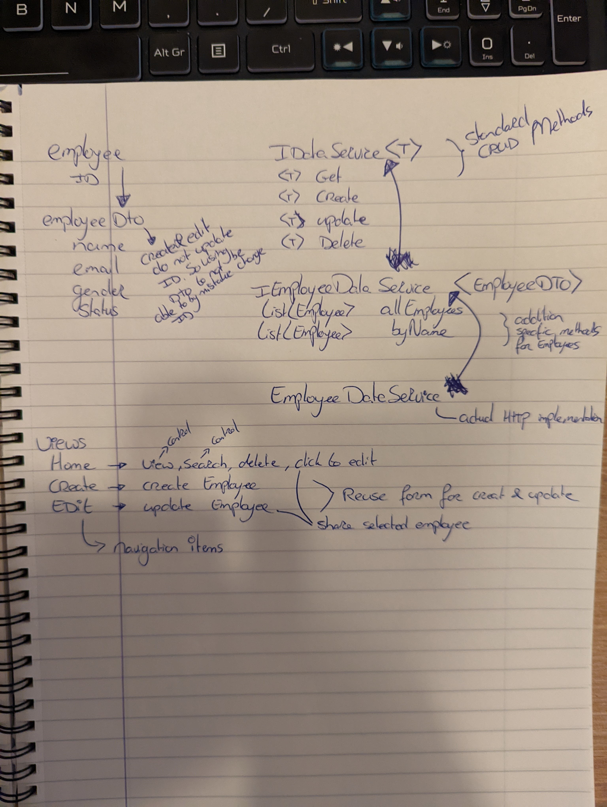

# EmployeeDetailApplication

Implementation assignment by Rick van Fessem

Follow chapters describe packages needed to compile the solution. Thought process before implementation and the actual implemented features.

## Additional Nuget packages required:
- Microsoft.Extensions.DependencyInjection --> For Dependency Injection
- Newtonsoft.Json --> For Json Serialization and Deserialization of data for the REST API
- Microsoft.Extensions.Http --> To use Dependeny Injection for the HTTP Client to create only one instance and reuse that same instance

## Notes before starting implementation

## Implementation
Used the newer version of the api for the features: https://gorest.co.in/public/v2/users

Focused on implementation of the functionality, using best practices and making the code modular, scalable and reusable. Did not focus on the design of the application.

List of implemented functions:

- View Employees (Home page)
- Search Employees by Name (Home page)
- Delete Employees (Home page)
- Edit Employees (Home page - redirect)
- Create Employees (Create page)